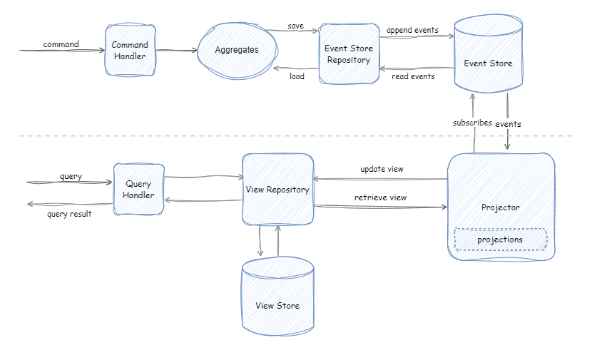

# sample-dotnet-cqrs-eventstore-elasticsearch-projection


Sample .NET Core Web API - CQRS and Event Sourcing implementation with Event Store and Elasticsearch projections




### Sample projection
```
public class UserViewProjection : Projection<UserView>
{
    public UserViewProjection(IViewRepository<UserView> viewRepository) : base(viewRepository)
    {
        Project<UserCreatedEvent>(OnUserCreated, e => e.UserId);
        Project<UserEmailUpdatedEvent>(OnUserEmailUpdated, e => e.UserId);
    }

    public async ValueTask<UserView> OnUserEmailUpdated(UserEmailUpdatedEvent @event, UserView view, CancellationToken cancellationToken)
    {
        return view with
        {
            Email = @event.Email
        };
    }

    public async ValueTask<UserView> OnUserCreated(UserCreatedEvent @event, UserView view, CancellationToken cancellationToken)
    {
        return view with
        {
            Id = @event.UserId,
            Firstname = @event.Firstname,
            Lastname = @event.Lastname,
            Email = @event.Email,
            Fullname = $"{@event.Firstname} {@event.Lastname}"
        };
    }
}
```

### Demo

```
docker-compose up
```
<pre>
<a href="http://localhost:5111/swagger">http://localhost:5001/swagger</a>
</pre>

Give a :star: if you like :) Thanks